# aws-eks

https://www.youtube.com/watch?v=mVSFHgItaa4

Step 1: Creating Spring Boot Application
Step 2: Create Docker Image
Step 3: Push Docker Image to Elastic Container Registry
Step 4: Pull Image from ECR and Deploy into EKS

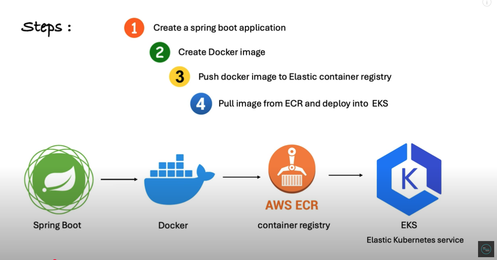

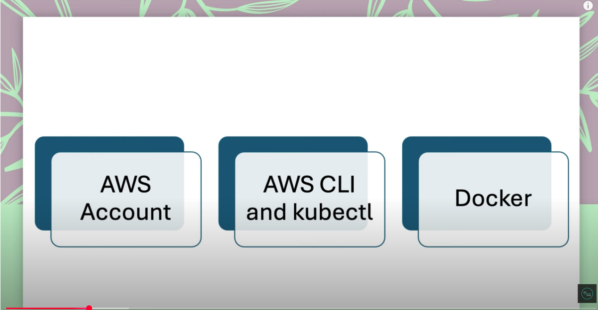

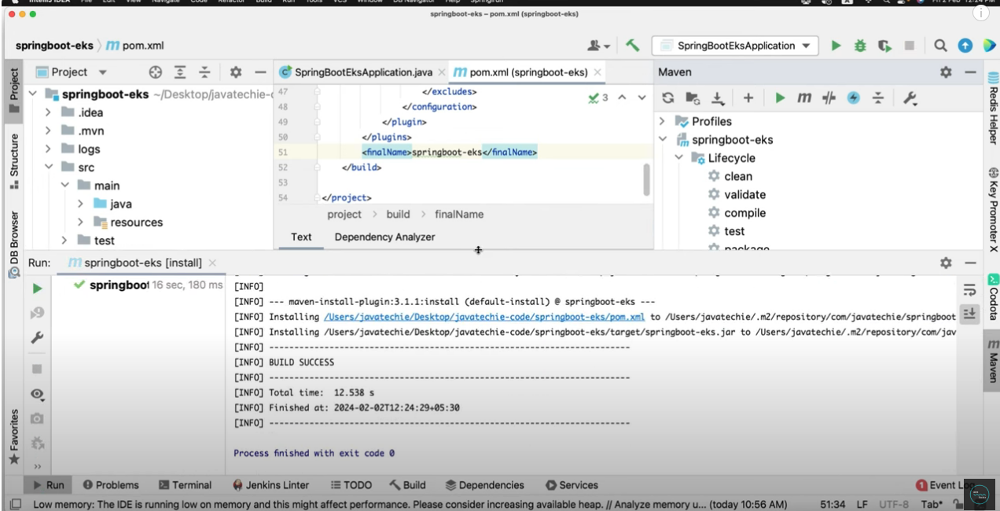
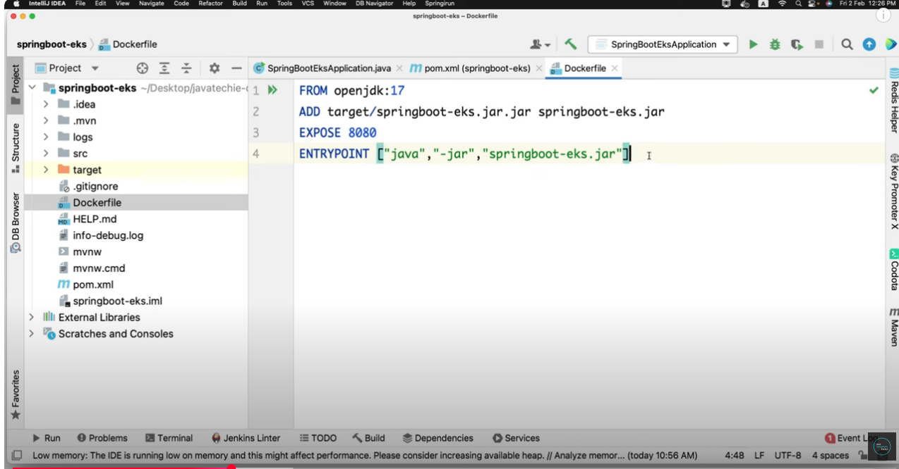
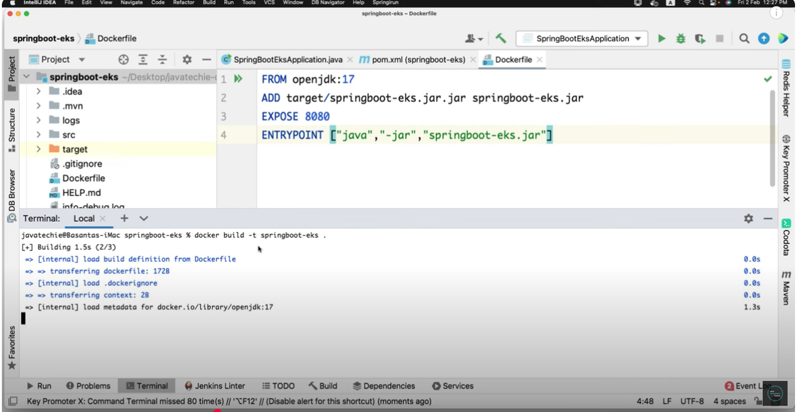
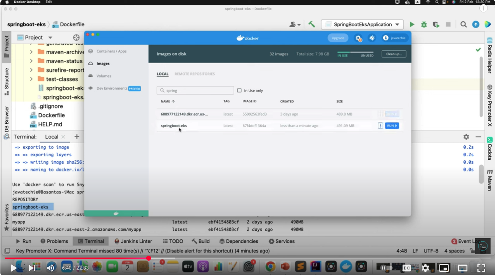
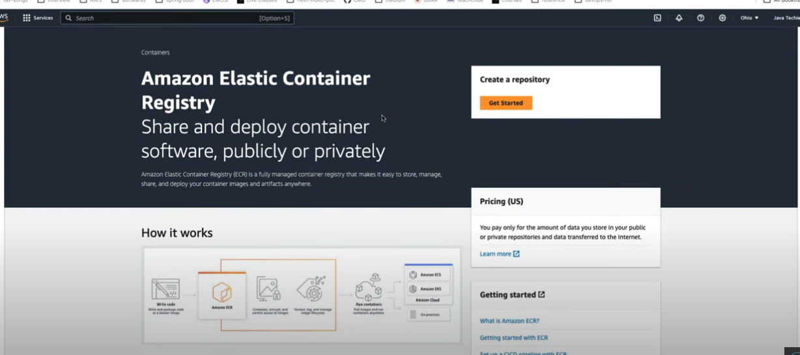
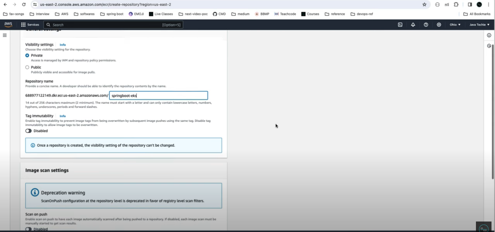
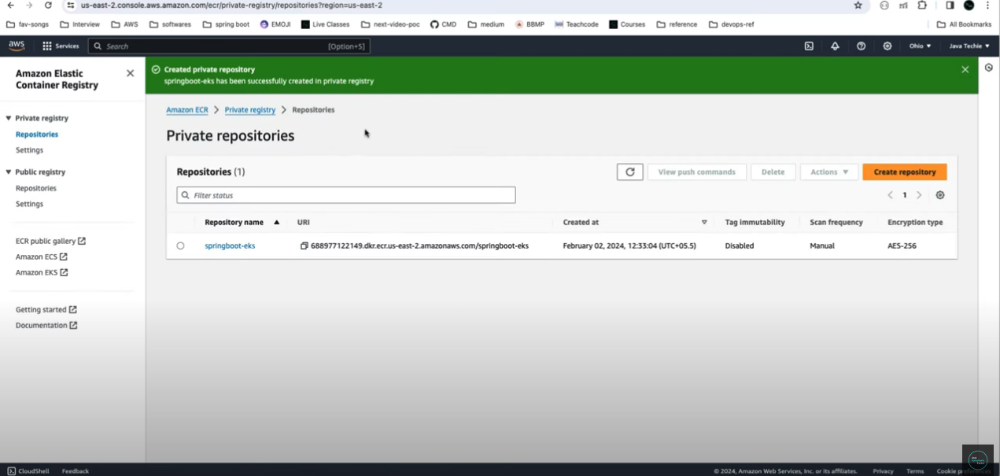
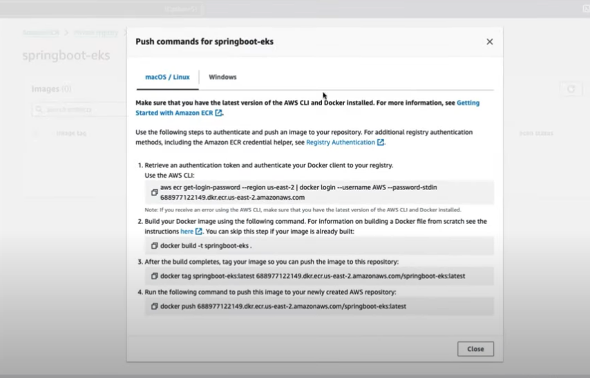
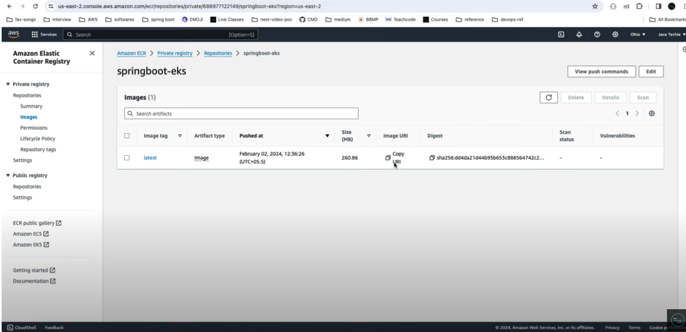
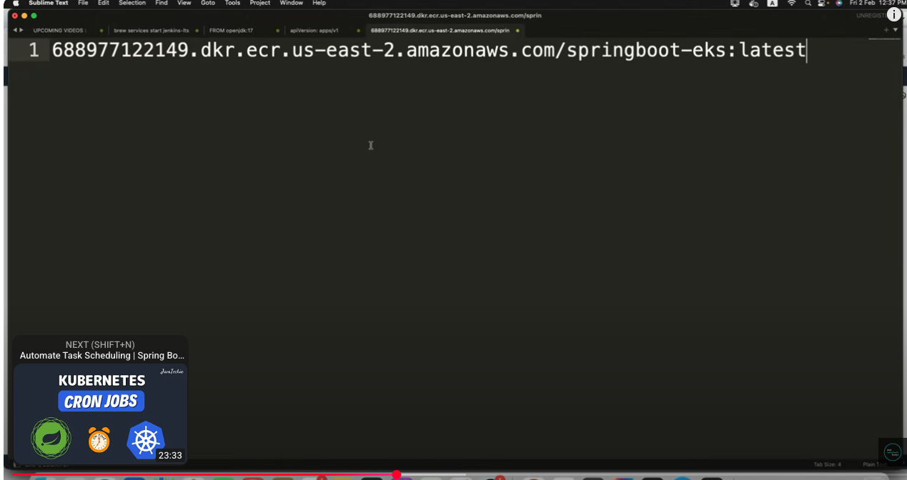

https://github.com/Java-Techie-jt/springboot-eks
https://github.com/Java-Techie-jt/springboot-eks/blob/main/k8s.yaml

The image illustrates the steps involved in deploying a Spring Boot application using Docker, AWS Elastic Container Registry (ECR), and Amazon EKS (Elastic Kubernetes Service). Below is a detailed explanation of each step:

### **Steps:**
1. **Create a Spring Boot application**
   - **Description**: Develop or create a Spring Boot application. This involves writing the code for your application, configuring it, and ensuring it runs locally.
   - **Icon**: The green icon with a leaf symbol represents Spring Boot.

2. **Create Docker image**
   - **Description**: Package the Spring Boot application into a Docker container. This involves creating a `Dockerfile` that defines how to build the Docker image, including dependencies and runtime configurations.
   - **Icon**: The blue whale icon represents Docker.

3. **Push Docker image to Elastic Container Registry**
   - **Description**: Upload the Docker image to AWS Elastic Container Registry (ECR). ECR is a managed Docker container registry service provided by AWS, which allows you to store, manage, and deploy Docker container images.
   - **Icon**: The orange circle with a shipping container icon represents AWS ECR.

4. **Pull image from ECR and deploy into EKS**
   - **Description**: Pull the Docker image from AWS ECR and deploy it into Amazon EKS. EKS is a fully managed Kubernetes service that simplifies running Kubernetes on AWS. This step involves creating Kubernetes manifests (e.g., YAML files) to define how the application should be deployed and scaled.
   - **Icon**: The blue hexagon with a "K" inside represents Amazon EKS (Elastic Kubernetes Service).

### **Visual Flow:**
- **Spring Boot** → **Docker** → **AWS ECR** → **EKS**
  - The arrows indicate the sequence of actions:
    1. Start with the Spring Boot application.
    2. Containerize the application using Docker.
    3. Push the Docker image to AWS ECR.
    4. Pull the image from ECR and deploy it into EKS.

### **Summary:**
This process automates the deployment of a Spring Boot application in a cloud environment using Docker for containerization, AWS ECR for storing container images, and EKS for orchestrating and managing the containers in a Kubernetes cluster. This approach ensures scalability, reliability, and ease of management for the application.

### **Key Components:**
- **Spring Boot**: A Java-based framework for building stand-alone, production-grade applications.
- **Docker**: A platform for developing, shipping, and running applications in containers.
- **AWS ECR**: A managed Docker container registry service for storing and distributing container images.
- **EKS**: A fully managed Kubernetes service for deploying and managing containerized applications.

This workflow is commonly used in modern DevOps practices for continuous integration and continuous deployment (CI/CD) pipelines.

